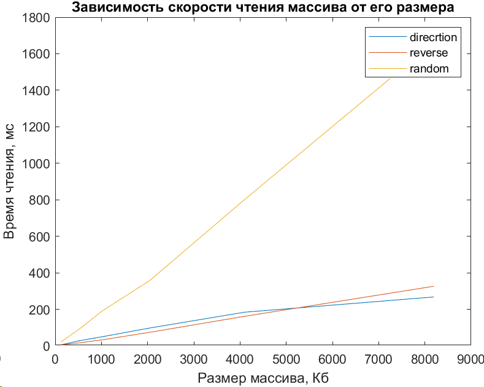

investigation:
travel_order: direction
- experiment:
number: 1
input_data:
buffer_size: 128Kb
results:
duration: 6.294ms
- experiment:
number: 2
input_data:
buffer_size: 256Kb
results:
duration: 12.856ms
- experiment:
number: 3
input_data:
buffer_size: 512Kb
results:
duration: 27.591ms
- experiment:
number: 4
input_data:
buffer_size: 1024Kb
results:
duration: 50.307ms
- experiment:
number: 5
input_data:
buffer_size: 2048Kb
results:
duration: 97.689ms
- experiment:
number: 6
input_data:
buffer_size: 4096Kb
results:
duration: 184.182ms
- experiment:
number: 7
input_data:
buffer_size: 8192Kb
results:
duration: 267.689ms

investigation:
travel_order: reverse
- experiment:
number: 1
input_data:
buffer_size: 128Kb
results:
duration: 5.487ms
- experiment:
number: 2
input_data:
buffer_size: 256Kb
results:
duration: 9.198ms
- experiment:
number: 3
input_data:
buffer_size: 512Kb
results:
duration: 16.336ms
- experiment:
number: 4
input_data:
buffer_size: 1024Kb
results:
duration: 33.187ms
- experiment:
number: 5
input_data:
buffer_size: 2048Kb
results:
duration: 74.229ms
- experiment:
number: 6
input_data:
buffer_size: 4096Kb
results:
duration: 161.737ms
- experiment:
number: 7
input_data:
buffer_size: 8192Kb
results:
duration: 326.304ms

investigation:
travel_order: random
- experiment:
number: 1
input_data:
buffer_size: 128Kb
results:
duration: 21.761ms
- experiment:
number: 2
input_data:
buffer_size: 256Kb
results:
duration: 44.936ms
- experiment:
number: 3
input_data:
buffer_size: 512Kb
results:
duration: 90.162ms
- experiment:
number: 4
input_data:
buffer_size: 1024Kb
results:
duration: 192.203ms
- experiment:
number: 5
input_data:
buffer_size: 2048Kb
results:
duration: 358.22ms
- experiment:
number: 6
input_data:
buffer_size: 4096Kb
results:
duration: 800.754ms
- experiment:
number: 7
input_data:
buffer_size: 8192Kb
results:
duration: 1663.45ms

